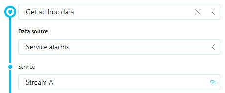

# GQIDSServiceAlarms

The GQI Data Source is designed to provide information about active alarms within a DataMiner service. By utilizing this data source, you can retrieve a row for each active alarm present in the service.

## Installation

Make sure to save this class in the DataMiner automation module. Don't forget to compile this as a library since this is not a typical automation script. More info in the [docs](https://docs.dataminer.services/user-guide/Advanced_Modules/Dashboards_and_Low_Code_Apps/Dashboards_app/Using_dashboard_feeds/Configuring_GQI_feeds/Configuring_an_external_data_source_in_a_query.html).

## Usage

You can use this data source in a dynamic context by linking the input of it to a feed in Dashboards or Low-Code Apps.

Available columns:

- ID (String)
- Element (String)
- Parameter (String)
- Value (String)
- Time (DateTime)
- Severity  (String)
- Owner (String)
