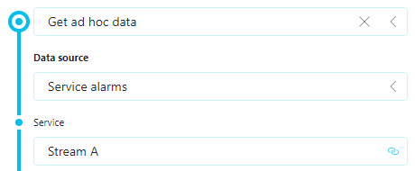

# About

This Data Source is designed to provide information about active alarms within a service. By utilizing this data source, you can retrieve a row for each active alarm present in the service.

## Key Features

- Requires **input parameters** (Service name)
- Returns alarms for the given service

## Available Columns

- ID (String)
- Element (String)
- Parameter (String)
- Value (String)
- Time (DateTime)
- Severity (String)
- Owner (String)

## Use Cases

You can use this data source in a dynamic context by linking the input of it to a feed in Dashboards or Low-Code Apps to:

- Monitor active alarms for a specific service
- Display alarm information in dashboards with real-time updates
- Filter and analyze service alarms by severity, owner, or time
